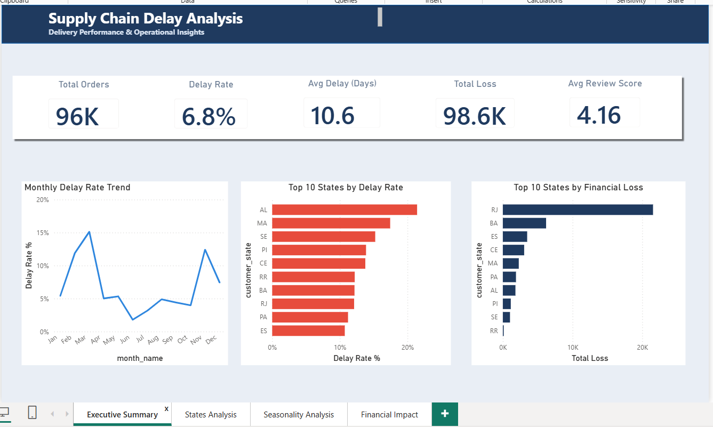
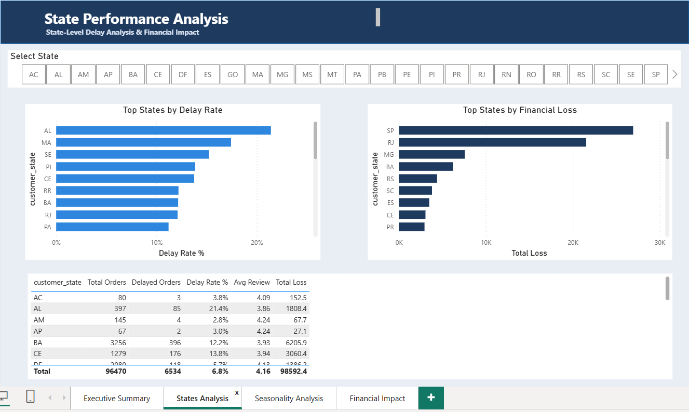
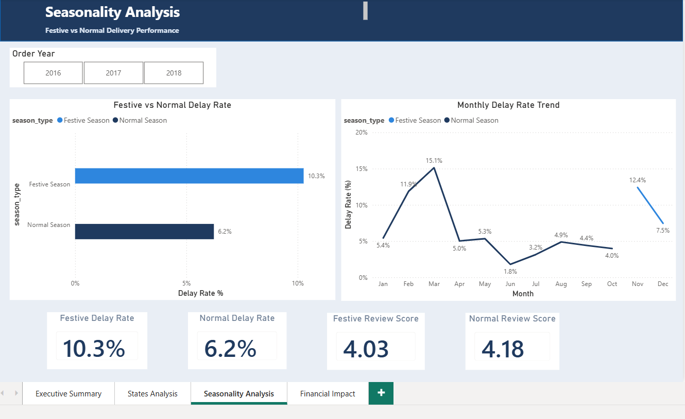
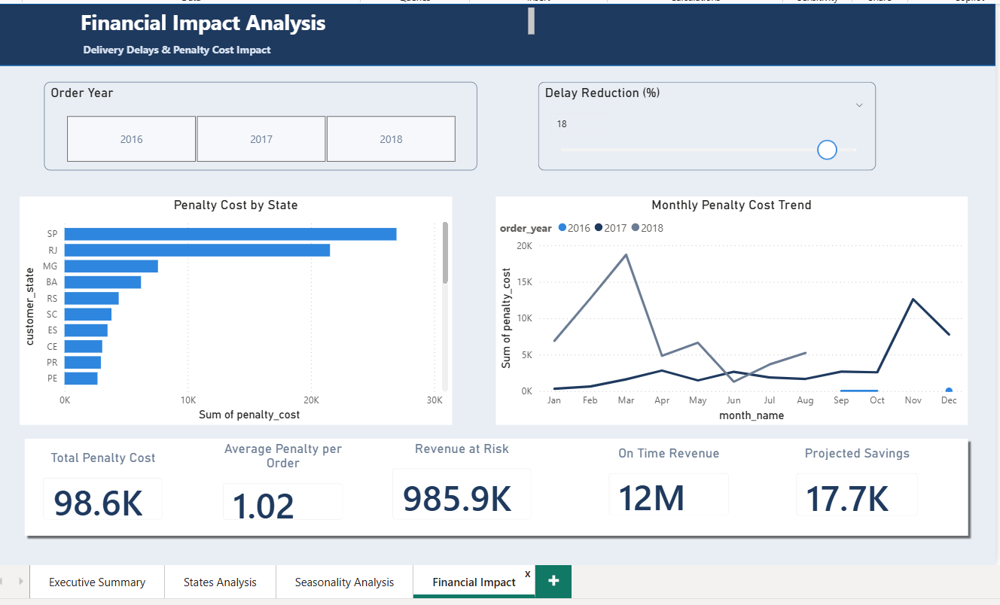
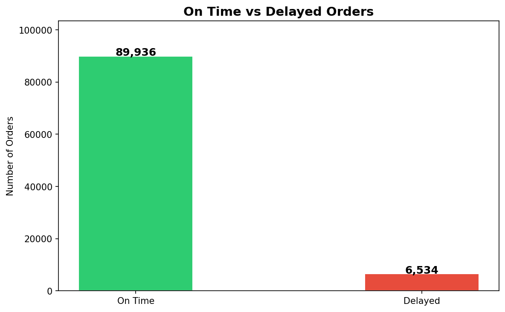
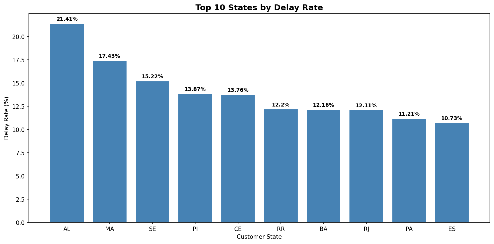
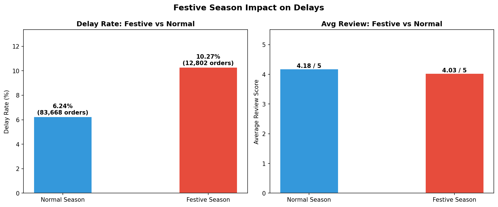
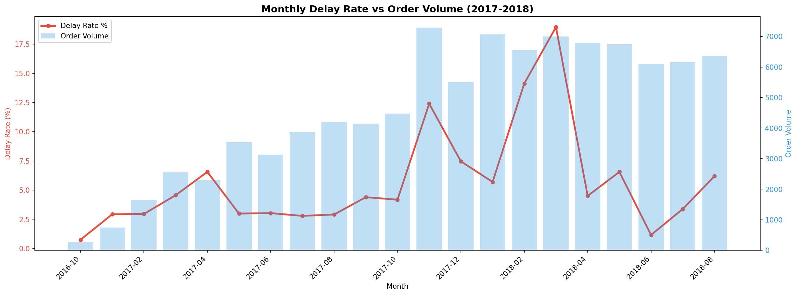
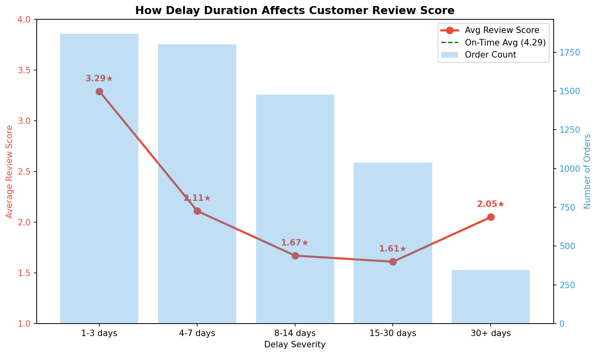
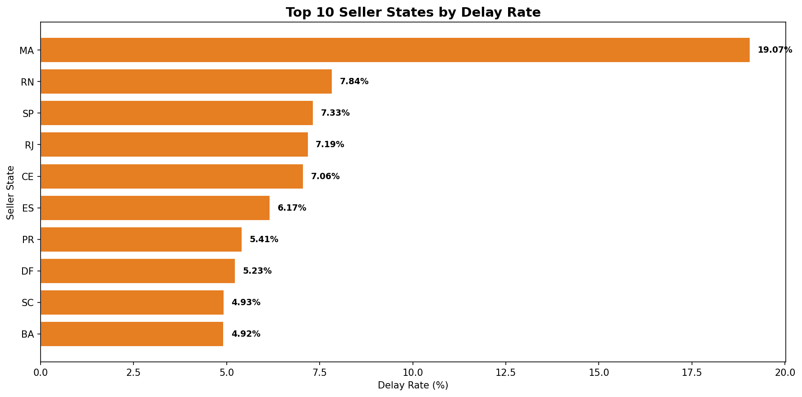

#  Supply Chain Delay Analysis
### Why are 1 in 15 deliveries arriving late — and what is it costing the business?

> Analyzed **96,470 orders** across Brazil's largest e-commerce platform · Identified states, sellers & seasons bleeding revenue · Delivered **5 data-backed recommendations** to cut delays by 20%

[](https://www.linkedin.com/in/priyanka-chaudhary775/)
[](https://github.com/priyanka-insights)


---

##  Business Impact — At a Glance

| Metric | Finding |
|---|---|
| Orders Analyzed | 96,470 delivered orders |
| Delayed Orders | 6,534 → **6.8% delay rate** |
| Average Delay Duration | **10.6 days** |
| Estimated Penalty Cost | **R$ 98,600** |
| Worst Performing State | **Alagoas (AL) — 21.4% delay rate** (3× national average) |
| Customer Satisfaction Drop | **4.29 → 1.70** (on-time vs 8+ day delay) |
| Potential Annual Recovery | **~R$ 20,000** with 20% delay reduction |

---

##  Dashboard Preview

> Power BI dashboard — 4 interactive pages with KPIs, state drill-down, seasonality analysis, and live scenario modeling.

###  Page 1 — Executive Summary


###  Page 2 — States Analysis


###  Page 3 — Seasonality Analysis


###  Page 4 — Financial Impact


---

##  EDA Charts

| Chart | Visual |
|---|---|
| On-Time vs Delayed |  |
| Top States by Delay Rate |  |
| Festive vs Normal Season |  |
| Monthly Trend |  |
| Delay vs Review Score |  |
| Seller State Delay |  |

---

##  The Business Problem

Olist — Brazil's largest e-commerce marketplace — was seeing a growing number of late deliveries. Late deliveries don't just inconvenience customers; they destroy review scores, trigger penalties, and erode long-term revenue.

**The question this analysis answers:**
> *Which states, seasons, and seller regions are driving delivery delays — and what is the financial and customer satisfaction impact?*

---

##  What the Data Revealed

###  The Scale of the Problem
6,534 orders failed to reach customers on time — generating **R$ 98,600 in estimated penalties** and dragging customer review scores to below 1.70 for the worst delays. This isn't a small operational hiccup — it's a measurable revenue and reputation risk.

###  The Hotspot States
**Alagoas (AL)** has a 21.4% delay rate — more than **3× the national average**. States like MA, SE, PI, and CE all sit above 13%. SP and RJ show lower delay rates but carry the highest absolute financial loss simply due to order volume.

###  The Seasonal Pattern
Every November–December, delay rates spike from **6.2% to 10.3%** while review scores slip from 4.18 to 4.03. Demand surges during the festive season — but logistics capacity doesn't scale to match it.

### 🏭 Where the Problem Starts
**MA-based sellers** have a 19.07% delay rate — the highest among seller states. This means the problem isn't just a last-mile logistics failure. It begins before the product even ships.

###  The Customer Satisfaction Cascade

| Delay Duration | Avg Review Score |
|---|---|
| On-Time | 4.29 / 5 |
| 1–3 Days Late | 3.29 / 5 |
| 4–7 Days Late | 2.11 / 5 |
| 8+ Days Late | < 1.70 / 5 |

Every additional week of delay compounds the damage. The 4-day mark is the critical threshold where customer satisfaction drops sharply.

---

##  Recommendations

| Priority | Action | Owner | Timeline | Expected Impact |
|---|---|---|---|---|
| 🔴 1 | Audit & replace AL, MA, SE logistics vendors | Operations Team | 30 days | ~15% delay reduction |
| 🔴 2 | Pre-position inventory by October | Supply Chain Team | Before Oct annually | ~20% cut in festive delays |
| 🟠 3 | Proactive outreach for all orders delayed 4+ days | Customer Support | Immediate | Protect review scores above 3.0 |
| 🟠 4 | Audit MA-based sellers for fulfilment issues | Seller Management | 45 days | Reduce origin-side delays |
| 🟡 5 | Set 20% delay reduction as Q1 OKR | Leadership | Q1 2025 | Recover ~R$ 20K in penalties annually |

---

##  How It Was Built

### Tech Stack

| Tool | Purpose |
|---|---|
| Python (Pandas) | Data loading, cleaning, feature engineering, EDA |
| MySQL | Data storage and business SQL queries |
| Power BI | Interactive dashboard and scenario modeling |
| Excel | Summary reporting |

### Data Pipeline

```
Raw CSV Files (5 Olist files)
        ↓
  Data_Loading_file.py       →  master_raw.csv (merged)
        ↓
  Data_Cleaning_file.py      →  supply_chain_clean.csv (cleaned + 8 new features)
        ↓
  EDA_file.py                →  6 business charts (PNG)
        ↓
  MySQL_Transport_file.py    →  MySQL table: supply_chain
        ↓
  analysis_queries.sql       →  7 business SQL queries
        ↓
  Power BI / Excel           →  Interactive dashboard + Excel report
```

### Dataset
**Source:** [Olist Brazilian E-Commerce Dataset — Kaggle](https://www.kaggle.com/datasets/olistbr/brazilian-ecommerce)

5 of 9 files used — scoped specifically to the delivery delay business question. Unused files (products, payments, geolocation) were excluded to keep the analysis focused.

### Feature Engineering (8 new columns)

| Column | Logic |
|---|---|
| `delay_days` | Actual delivery − Estimated delivery date |
| `is_delayed` | 1 if delay_days > 0, else 0 |
| `order_month` | Month extracted from purchase timestamp |
| `order_year` | Year extracted from purchase timestamp |
| `is_festive` | 1 if month is Nov or Dec (Brazil peak season) |
| `delivery_time` | Actual days from purchase to delivery |
| `estimated_time` | Promised days from purchase to estimated delivery |
| `penalty_cost` | 10% of order value for delayed orders (modelling assumption) |

### SQL Analysis (7 Queries)

| # | Query | Complexity |
|---|---|---|
| 1 | Overall business health summary | Basic |
| 2 | State-wise delay ranking | Basic |
| 3 | Festive vs Normal season comparison | Intermediate |
| 4 | Monthly trend analysis | Intermediate |
| 5 | Running cumulative delays | Advanced — Window Function |
| 6 | Month-over-month delay change | Advanced — LAG Function |
| 7 | Priority customer list for support team | Advanced — CTE + JOIN |

### Power BI Dashboard (4 Pages)

| Page | What It Shows |
|---|---|
| Overview | KPIs, monthly trend, top states by delay rate and financial loss |
| State Performance | State-level drill-down with delay rate vs financial loss |
| Seasonality Analysis | Festive vs normal season delay rate and review score |
| Financial Impact | Penalty cost by state + **Delay Reduction % slicer** for live scenario modeling |

---

## ▶ How to Run

### Install dependencies
```bash
pip install pandas sqlalchemy mysql-connector-python matplotlib seaborn
```

### Run Python pipeline (in order)
```bash
python scripts/Data_Loading_file.py
python scripts/Data_Cleaning_file.py
python scripts/EDA_file.py
python scripts/MySQL_Transport_file.py
```

### MySQL setup
```sql
CREATE DATABASE olist_supply_chain;
```
Then run `MySQL_Transport_file.py` to load clean data into MySQL.

> Before running, replace `your_password_here` with your MySQL password in `MySQL_Transport_file.py`

### SQL queries
Open `analysis_queries.sql` in MySQL Workbench and run individually or all at once.

### Power BI
Open `Supply_Chain_Analysis.pbix` in Power BI Desktop. Data is pre-loaded.

---

##  Limitations & Future Scope

- `penalty_cost` is modelled at 10% — not a contractual figure from the dataset
- Only 5 of 9 Olist files used; future scope includes product category and payment analysis
- No ML model built yet — next step: predict delay probability at order placement using logistic regression
- Geographic mapping of delay hotspots (using the geolocation file) would strengthen state-level findings

---

##  Author

**Priyanka Chaudhary** — Data Analyst | Python · SQL · Power BI

[](https://www.linkedin.com/in/priyanka-chaudhary775/)
[](https://github.com/priyanka-insights)

---

##  License

This project uses publicly available data from Kaggle under the [CC BY-NC-SA 4.0](https://creativecommons.org/licenses/by-nc-sa/4.0/) license.
